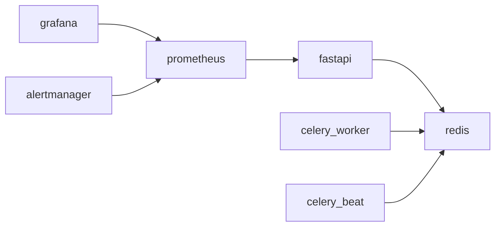

# Docker Compose

## Сервисы



| Сервис | Назначение |
|--------|------------|
| **fastapi** | HTTP API, `/help/`, `/app/` |
| **celery_worker** | Pipeline отчётов |
| **celery_beat** | Периодические задачи, метрики |
| **redis** | Брокер Celery |
| **prometheus** | Сбор метрик |
| **grafana** | Дашборды |
| **alertmanager** | Telegram-алерты |
| **traefik** | TLS (опционально) |

## Файлы

| Файл | Назначение |
|------|------------|
| `docker-compose.dev.yml` | Локальная разработка |
| `docker-compose.prod.yml` | Базовый prod |
| `docker-compose.prod.traefik.yml` | + Traefik |
| `docker-compose.prod.standalone.yml` | Без Traefik (SMDG) |

## Локальная разработка

```bash
cp .env.example .env
./deploy-dev.sh
```

API: http://localhost:8000/docs

## Production

```bash
./scripts/build-docs.sh
./deploy.sh
```

## Volumes

| Host path | Назначение |
|-----------|------------|
| `app/data/` | SQLite |
| `storage/pdfs/` | PDF и графики |
| `storage/formatted/` | Excel, PPTX |
| `storage/uploads/` | Загрузки |
| `chroma_data/` | Self-healing |
| `logs/` | Логи |
| `site/` | MkDocs → `/help/` |
| `frontend/` | SPA |
| `secrets/` | Google SA |

!!! warning
    Не удаляйте volumes при `docker compose down -v` на production.

## Полезные команды

```bash
docker compose -f docker-compose.prod.yml ps
docker logs -f reportagent_fastapi
docker exec reportagent_fastapi curl -s http://localhost:8000/health
```
