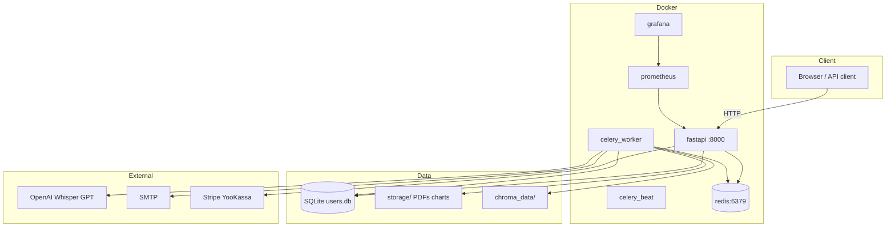

# Архитектура

## Обзор

ReportAgent — FastAPI-приложение с фоновым pipeline на Celery, Redis, SQLite и статическим фронтендом (Vanilla JS).



## Слои приложения

| Слой | Каталог | Ответственность |
|------|---------|-----------------|
| Routers | `app/routers/` | HTTP API |
| Agents | `app/agents/` | Pipeline отчётов |
| Voice | `app/voice/` | Whisper + intent |
| Middleware | `app/middleware/` | Auth, rate limit, metrics |
| Tasks | `app/tasks.py` | Celery orchestration |
| DB | `app/db/` | SQLite, миграции |
| Admin | `app/admin/` | Admin API helpers |
| Self-healing | `app/self_healing/` | ChromaDB RAG |
| Frontend | `frontend/` | SPA (hash routes) |

## Pipeline отчёта

```
context_loader → parser → analyst → visualizer → formatter → sender
```

Голосовой путь: `voice/orchestrator` → тот же pipeline.

## Аутентификация

- **JWT** (15 мин) — регистрация, создание первого ключа
- **X-API-Key** — все защищённые эндпоинты
- **X-Admin-Key** — `/admin/*`

## Документация

MkDocs Material → `site/` → монтируется на `/help/` в FastAPI.

## CI/CD

GitHub Actions → SSH VPS → `./deploy.sh`

## Связанные документы

- [Схема БД](database-schema.md)
- [Агенты](agents.md)
- [Self-healing](self-healing.md)
