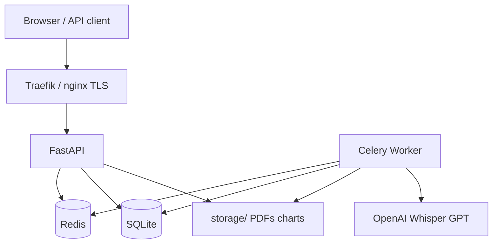

# ReportAgent Documentation

**ReportAgent** is a micro-SaaS for automated analytical report generation from CSV, Excel, and Google Sheets.

## Features

- File upload or public Google Sheets URLs
- Reports in PDF, Excel, PowerPoint, Notion, Google Slides
- Data and chart preview before final generation
- Voice input (Whisper + GPT intent parsing)
- Email delivery and API download
- Webhooks on report completion
- Subscriptions (Stripe / YooKassa)
- Self-healing RAG for agent error recovery
- Prometheus + Grafana + Telegram alerts

## Navigation

### For users

1. [Getting started](user-guide/getting-started.md) — registration, API key, UI
2. [Reports](user-guide/reports.md) — create and download
3. [Preview](user-guide/preview.md) — preview before generation
4. [Output formats](user-guide/output-formats.md) — PDF, Excel, PPTX, Notion, Slides
5. [Voice](user-guide/voice.md) — voice requests
6. [Subscription](user-guide/subscription.md) — plans and billing
7. [Preferences](user-guide/preferences.md) — theme, charts, email

### For administrators

1. [Deployment](admin-guide/deployment.md)
2. [Configuration](admin-guide/configuration.md)
3. [Monitoring](admin-guide/monitoring.md)
4. [Backup](admin-guide/backup.md)

### For developers

1. [Architecture](developer-guide/architecture.md)
2. [Database schema](developer-guide/database-schema.md)
3. [Agents](developer-guide/agents.md)
4. [API](api/index.md)

## Architecture (overview)

## Version

Current API version: **1.8.0** (see `/health` and [Changelog](misc/changelog.md)).

## Related URLs

| URL | Description |
|-----|-------------|
| `/docs` | Swagger UI (OpenAPI) |
| `/app` | Web dashboard |
| `/help/` | This documentation |
