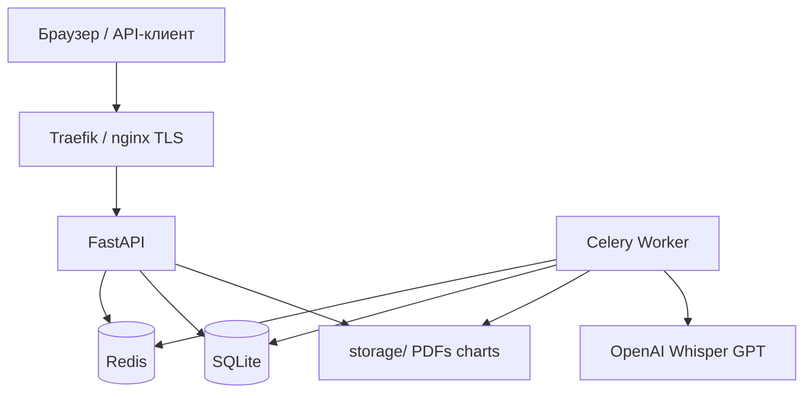

# ReportAgent — документация

**ReportAgent** — micro-SaaS для автоматической генерации аналитических отчётов из CSV, Excel и Google Sheets.

## Возможности

- Загрузка файлов или публичных Google Sheets
- Отчёты в PDF, Excel, PowerPoint, Notion, Google Slides
- Превью данных и графиков перед отправкой
- Голосовой ввод (Whisper + GPT intent)
- Email-доставка и скачивание по API
- Webhooks при готовности отчёта
- Подписки (Stripe / ЮKassa)
- Self-healing RAG для автоматического исправления ошибок агентов
- Prometheus + Grafana + Telegram-алерты

## Навигация

### Для пользователей

1. [Начало работы](user-guide/getting-started.md) — регистрация, API-ключ, интерфейс
2. [Отчёты](user-guide/reports.md) — создание и скачивание
3. [Превью](user-guide/preview.md) — предпросмотр перед генерацией
4. [Форматы](user-guide/output-formats.md) — PDF, Excel, PPTX, Notion, Slides
5. [Голос](user-guide/voice.md) — голосовые запросы
6. [Подписка](user-guide/subscription.md) — тарифы и оплата
7. [Настройки](user-guide/preferences.md) — тема, графики, email

### Для администраторов

1. [Деплой](admin-guide/deployment.md)
2. [Конфигурация](admin-guide/configuration.md)
3. [Мониторинг](admin-guide/monitoring.md)
4. [Резервное копирование](admin-guide/backup.md)

### Для разработчиков

1. [Архитектура](developer-guide/architecture.md)
2. [Схема БД](developer-guide/database-schema.md)
3. [Агенты](developer-guide/agents.md)
4. [API](api/index.md)

## Архитектура (кратко)

## Версия

Текущая версия API: **1.8.0** (см. `/health` и [Changelog](misc/changelog.md)).

## Связанные ресурсы

| URL | Описание |
|-----|----------|
| `/docs` | Swagger UI (OpenAPI) |
| `/app` | Веб-интерфейс (дашборд) |
| `/help/` | Эта документация |
